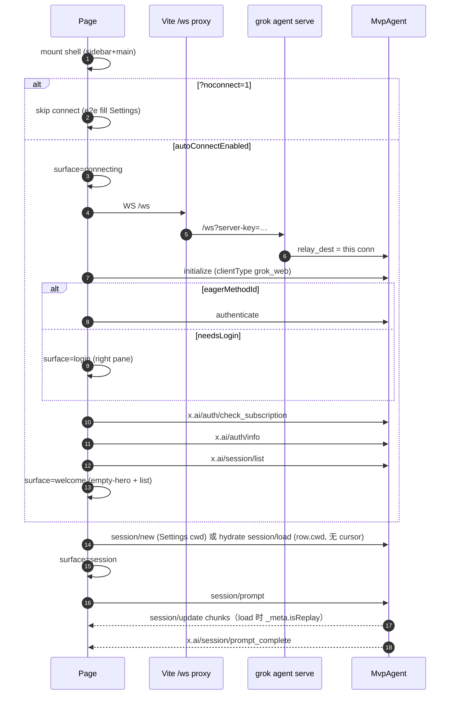

# Grok Web 双栏桌面客户端改版设计

| 字段 | 值 |
|---|---|
| **Title** | Grok Web Chat Shell Redesign |
| **Author** | falser |
| **Date** | 2026-08-22 |
| **Status** | Draft（review round 2） |
| **Repo** | `/home/falser/Projects/grok-build` |
| **Scope** | `web/` 信息架构与视觉全改；不改 `MvpAgent`、不改 `grok agent serve` 运输层 |

---

## Overview

当前 `web/` 是 Slice 0 原型：顶栏 mast + 连接 dock + 全屏 stage（connecting / doctor / login / Welcome 互斥）+ 底部 composer。Welcome「继续上次」只取 `x.ai/session/list` 的第一条；会话一旦开始，列表就消失。这和 ChatGPT / Claude 的「左栏会话、右栏对话」产品形态差一整层 IA，不是改间距能补上的。

本设计把 Grok Web 做成**常驻双栏桌面壳**：左栏是 session 列表与操作，右栏是时间线 + composer；左栏底部是账号芯片 + Settings。Settings **必须是 modal**，不是独立全页路由。Connecting / doctor / login / Welcome 从「永远占满 stage」降级为壳内 overlay 或右栏 empty state。ACP 运输（`AcpClient`、`initialize` → `authenticate` → `session/load`、Vite `/ws` 代理、`?noconnect=1`）保持不变。语义对齐 TUI（同一 `~/.grok/sessions/`、同一权限卡 payload、同一 tool 结果），**不做** TUI 单元格克隆。

---

## Background & Motivation

### 当前实现（代码为准，catalog「Web 已实现」列经常过期）

入口与 DOM 骨架：

- [`web/index.html`](web/index.html)：`#app` 上 `data-surface` / `data-phases`；mast、dock、banner、stage（connecting / doctor / login / welcome / `#thread`）、composer。
- [`web/src/main.ts`](web/src/main.ts)：~970 行 God module。握手、气泡、composer gate、tab lock、权限 cancelled stub 全在这里。
- [`web/src/acp.ts`](web/src/acp.ts)：JSON-RPC over WS，15s `"ping"`，`toWireMethod` 对 `x.ai/*` 加 `_` 前缀。
- [`web/src/protocol.ts`](web/src/protocol.ts)：`CLIENT_TYPE = "grok_web"`，不宣称 `fs` / `terminal`，`defaultWsUrl()` 走同源 `/ws`。
- [`web/src/startup.ts`](web/src/startup.ts)：鉴权决策、doctor 文案、`parseSessionList`（目前只取 `sessionId` / `summary` / `cwd`）、composer gate。
- [`web/src/style.css`](web/src/style.css)：grok-night 变量（`--bg #12110e`、`--accent #d4ff4a`）。`#app` 是五行 grid，不是双栏。
- DX：[`web/scripts/dev.mjs`](web/scripts/dev.mjs) 在 `127.0.0.1:2419` 空闲时拉起 `grok agent --always-approve --no-leader serve`；[`web/vite.config.ts`](web/vite.config.ts) 把 `/ws` 代理到 serve 并注入 `server-key`。

痛点：

1. **没有 session 一等公民表面。** `afterAuthenticated` 调了 `x.ai/session/list`（[`main.ts`](web/src/main.ts) `buildSessionListParams`，`limit: 30`, `allowRelax: true`），但 UI 只用 `recentSessions[0]` 喂「继续上次」（catalog A-13 / S-06 明确说这不是 picker）。
2. **启动表面是全屏 stage。** `showSurface()` 互斥隐藏 connecting/doctor/login/welcome；连上之后 Welcome 挡住时间线。Chat 产品应始终露出壳。
3. **连接控件占顶栏。** WS URL / Secret 在 dock「高级连接」；产品意图是 Settings modal。cwd 也挤在 dock。
4. **账号与设置无落点。** 退出登录 / 切换账号挂在 dock；consent / paywall / trust 全塞进 Welcome 卡。
5. **权限卡仍是 Slice 0 cancelled。** `session/request_permission` / `x.ai/ask_user_question` 回 cancelled，所以本地必须 `--always-approve`。改版壳必须留 hook，但第一批 PR 不必做完卡。
6. **`main.ts` 不可扩展。** 再往上堆 Markdown / slash / 权限卡会无法 review。

硬约束（不可谈判）：

- `serve` `relay_dest` **同时一条 WebSocket**；第二标签抢走流。现有 `BroadcastChannel(TAB_LOCK_CHANNEL)` 必须保留。
- 默认 bind `127.0.0.1:2419`，无静态托管、无 Origin 校验。**不要**绑 `0.0.0.0`。
- 浏览器是不信任 UI；Agent 是带工具的本机用户。`initialize` 继续 `fs.readTextFile/writeTextFile = false`、`terminal: false`。
- 技术栈：vanilla TypeScript + Vite，无 React。E2E：Playwright [`web/e2e/`](web/e2e/)，`?noconnect=1` + `fillDock`。

---

## Goals & Non-Goals

### Goals

- 落地 ChatGPT/Claude 式双栏壳：左 session、右 timeline+composer、左底账号+Settings。
- Settings 以 **modal** 为唯一主表面（`U-07`），不是 `/settings` 全页路由。
- 把现有启动表面映射进壳，而不是删掉鉴权语义。
- 第一期用**已经能打的 ACP** 做出可点的列表 + 对话；权限卡 / Markdown / slash 分后续 PR。
- **v1 会话 UI 只有左侧列表**：列出、点开、新建。不做侧栏搜索、删除、重命名、fork、worktree。
- 保住 auto-connect、Vite 代理注 secret、`?noconnect=1`、tab steal、reconnect handshake。
- 语义对齐 catalog 02 / 03 / 04 / 05 / 08 / 14 / 19 / 20 的 P0，像素不对齐 TUI。

### Non-Goals

- 不重写 `MvpAgent`、不改 serve 单连接模型、不把 HTML 塞进 serve（W-15）。
- 不接 leader.sock（W-08）、不宣称 fs/terminal 反向能力（Q-12–14）。
- 不做 Dashboard 进程 roster（U-51 / catalog 09）、MCP marketplace、语音、status-line 用户脚本（H-09 XSS）。
- 不做 TUI 单元格栅格、vim 输入、gboom、FPS HUD、xterm 套 TUI。
- 不在本改版引入 React/Vue（见 Key Decisions）。后续若状态爆炸可另开 RFC。
- 不把 API key 写入 `localStorage`（A-09 已实现，必须保持）。
- 不做 `x.ai/facetFilters` UI（v1 列表请求不带 kind 过滤，以免藏掉 chat 行）。
- 不做列表分页 UI（cap 30，信任 Agent 排序）；不做 catalog U-10 的 `/sessions` 全屏路由。
- 不做 S-18「在新 worktree 里 resume 该行」（`x.ai/git/worktree/resume_session` / `x.ai/session/resolve_local_for_worktree_resume`）。
- S-17 **不用** `x.ai/git/worktree/create`（异步 Creating + 预 `session/new`）；只用 `create_from_worktree_sync`。
- 不调用 `x.ai/session/load_history`：[`chat_conversation_history.rs`](crates/codegen/xai-grok-shell/src/extensions/chat_conversation_history.rs) 现恒返回 `method_not_found`。历史只能靠 `session/load` 重放。

---

## Key Decisions

| # | 决策 | 选择 | 理由 |
|---|---|---|---|
| KD-1 | 布局 | 固定双栏：左 280px session rail + 右 chat；**无**顶 dock。窄屏左栏变 overlay drawer。 | 用户草图是权威 IA。mast+dock 是原型脚手架。 |
| KD-2 | Settings 表面 | **Modal**（居中 dialog + dimmer）。连接/Secret 从 dock 迁入「高级」分组。 | 用户明确「不要全页路由当主表面」。TUI 也是 F2 overlay（U-07）。 |
| KD-3 | Welcome 去留 | 取消全屏 Welcome。未选 session 时右栏 empty hero（产品名 / cwd / 版本 / 主 CTA）+ 左栏列表即 picker。 | A-13 要「最近 session 列表」；S-16 退出会话回列表且**不断 WS**。 |
| KD-4 | 启动表面 | 壳始终 mount。connecting = **半透明**全壳 overlay（侧栏骨架可见）；doctor / login = 右栏卡片（左栏仍在；列表 CTA 禁用，**`#account-chip` 仍可点「登录」**）；trust / workspace ACK / paywall / consent = 右栏或 modal 阻塞卡。 | 避免「永远停在 stage」。e2e 仍可用 `#doctor` / `#login` 等稳定 id。 |
| KD-5 | UI 框架 | **继续 vanilla TS 模块**，不引入 React。 | 见下文「Componentization」。小团队、现有 Playwright 选择器、`window.__grokWebTest`、无 JSX 工具链。改版成本应花在 IA 而不是重写测试夹具。 |
| KD-6 | 状态 | 单一 `AppStore` + **具名事件**（见状态模型）。写路径：只有 handshake / incoming / session-actions 调 `dispatch`。UI 只 `subscribe`。ACP 仍一份 `AcpClient`。 | 替代 `main.ts` 40+ 个闭包 `let`。不过度上 Redux。拆模块前先把事件表钉死。 |
| KD-7 | Session 列表数据 | **v1：只展示 `x.ai/session/list`**（`limit: 30`, `allowRelax: true`）。点行 hydrate，`+`/`新会话` → `session/new`。不传 `cursor`、不传 `facetFilters`。**不做**标题搜索、`?` 内容搜索、删除、重命名、fork、worktree。这些是后续 PR。 | 用户拍板：「session 再左侧展示列表不就行了」。侧栏就是唯一 picker。 |
| KD-8 | 权限卡 | 本改版壳只留 **PendingRequest 队列 + 时间线锚点**。Slice 0 继续回 cancelled，直到独立 PR 实现 B-01/B-10/B-15。本地 debug 仍 `--always-approve`。 | 用户允许后续 PR 填卡；壳不能把 handler 写死在 `main.ts` 里再也拔不出来。 |
| KD-9 | 视觉 | **保留 grok-night CSS 变量**，做成桌面 chat 排版（气泡、侧栏、modal），不是终端格子。 | `--accent #d4ff4a` 已是产品色。V-01 映射槽继续用。 |
| KD-10 | 路由 | **无前端 router。** URL 只保留 `?noconnect=1`；可选后续 `?session=<id>` 作 load 深链（S-02：创建仍由 Agent 生成 id）。 | 本机单页、单 WS。catalog U-10 的 `/sessions` 全屏路由否决（见 Alternative C）。 |
| KD-11 | cwd 两套 | **Settings cwd** 只 scope **新会话** 和 **list 查询**。picker 上 load / delete / rename / fork 一律用 **`row.cwd`**（空则回落 Settings cwd）。打开 session 后顶栏/芯片可显示该 session 的 cwd，改 Settings cwd **不**改已打开 session（S-03：cwd 必须对上存储 key）。 | `allowRelax: true` 会返回其它目录 / worktree 行；继续把 `cwd.value` 塞进 `session/load` 会 404 或装错仓。 |
| KD-12 | 发送键 | v1 **保持** Enter 发送 / Shift+Enter 换行（现网 + e2e）。Settings 预留「Enter 换行」开关（I-02），默认关。 | 不在改版 PR 里同时改键位，避免 e2e 与肌肉记忆双崩。 |
| KD-13 | 打开会话 = hydrate | 点列表行是 **picker open**：清空时间线、`lastEventId = null`、`session/load` **带 row.cwd、不带 cursor**，按 `_meta.isReplay` 画历史（C-34/C-35）。**禁止**把重连用的 cursor 带到另一条 session。重连同一 `sessionId` 才带 cursor。 | 现 `buildSessionLoadParams` + `lastEventId` 只服务「同一 live session 断线续上」。`x.ai/session/load_history` 恒 `method_not_found`。 |
| KD-14 | YOLO / permission_mode | Settings Agent 组是 **真实 setter**（用户决定，覆盖先前只读稿）。分段控件 ask / auto / always-approve（YOLO）。切到 YOLO 先 confirm（G-15 会排空队列）。Apply：C→A **无 id** notification `x.ai/yolo_mode_changed`（wire `_x.ai/yolo_mode_changed`），payload `yolo_mode` / `permission_mode` / `clientIdentifier`（`CLIENT_IDENTIFIER` = `grok-web`）。同时听 A→C 同方法与 `x.ai/settings/update` 刷新芯片。PR-4 交付此控件。 | 无 `x.ai/settings/set`。`session/load` `_meta.yoloMode` 只在 load 时生效，live 切换必须走 notification。PR-6 之前 `session/request_permission` 仍 cancelled：无 `--always-approve` 的 serve 上开 YOLO 会挂起或工具 no-op。UI 必须写明。`dev.mjs` 在 PR-6 前可继续 `--always-approve`。 |
| KD-15 | 快捷键焦点 | `[` / `]` 折叠侧栏 **仅当焦点不在** `textarea`/`input`/`[contenteditable]`。Esc 栈：confirm → settings → account popover → 窄屏 drawer；**永不**用 Esc 回答权限卡（B-05）。 | 否则在 composer 里写数组/Markdown 会误折叠侧栏。 |

---

## Proposed Design

### 信息架构

```
┌─ #app.shell ─────────────────────────────────────────────────────────┐
│ ┌─ #sidebar 280px ──────────┐ ┌─ #main ─────────────────────────────┐ │
│ │ #sidebar-head             │ │ #main-header (session title, chips) │ │
│ │   [+ 新会话] [搜索]        │ │                                     │ │
│ │ #session-search           │ │ #timeline  (follow-tail)            │ │
│ │ #session-list             │ │   user / agent / think / tool       │ │
│ │   row…                    │ │   [permission/ask/plan 锚点]        │ │
│ │                           │ │   empty-hero 当无 session            │ │
│ │                           │ ├─────────────────────────────────────┤ │
│ │ #sidebar-foot             │ │ #composer                           │ │
│ │  账号芯片 · 连接点         │ │   textarea + Send/Stop              │ │
│ │  [设置]                   │ │                                     │ │
│ └───────────────────────────┘ └─────────────────────────────────────┘ │
│ #modal-root：Settings / doctor-retry / login-extra / confirm / trust   │
│ #toast-root：reconnect / stolen / startupWarnings                      │
└───────────────────────────────────────────────────────────────────────┘
```

#### Chrome 尺寸（桌面 ≥ 960px）

| 元素 | 规格 |
|---|---|
| 左栏展开 | **280px** 默认；可拖 220–360px（`localStorage` `grok-web.sidebar-width`） |
| 左栏折叠 | **48px** icon rail：只留「新会话 / 列表 / 账号头」；hover 或 `]` 展开 |
| 右栏顶栏 | 48px：标题（可点改名）、cwd 缩写、live 点、模型 chip（v1 只读）、Stop |
| 时间线 | `flex: 1; overflow: auto`；内容 `max-width: 72ch` 居中（现 bubble 已是 72ch） |
| Composer | 底栏 padding 16px；textarea min-height 72px、max 40vh |
| Settings modal | 宽度 `min(640px, calc(100vw - 48px))`，高度 `min(80vh)`，自身滚动 |
| 折叠快捷键 | `[` 折叠侧栏，`]` 展开（**焦点不在输入框时**，KD-15）；Esc 走下面的栈 |

#### 窄视口（< 960px）

- 左栏改为 **drawer overlay**（默认关）。顶栏汉堡打开。
- Composer 全宽。Settings modal 仍居中。
- **不**做手机优先信息架构；本产品是本机桌面客户端。`< 600px` 只保证能登录、能发一句。

**Esc 栈（KD-15，自上而下消费一次）：** 打开的 `#confirm` → `#settings-modal` → 账号 popover → 窄屏 sidebar drawer。doctor/login 卡片不靠 Esc 关掉（它们是右栏主内容）。权限 pending 卡 **不在此栈**（B-05：Esc 不等于 Reject；PR-1a/1b 无卡，handler 仍 cancelled）。Settings 焦点 trap 只在 `#settings-modal` 打开时生效。

#### 空状态矩阵

| 条件 | 左栏 | 右栏 | Composer |
|---|---|---|---|
| 未连接 / connecting | 骨架屏 6 行（透过半透明 overlay 可见，不可点） | 「正在连接本机 grok…」居中（`CONNECTING_COPY`）；overlay `background: #12110ecc`，**不** `display:none` 掉侧栏 | disabled |
| doctor（401 / process-down） | 空列表 + 禁用 CTA；芯片可点开 Settings 重试 | `#doctor` 卡片（文案 `doctorCopy()`）+ 重试 | disabled |
| 已连接未登录 | 空列表，**列表 CTA 禁用**；`#account-chip` **仍可点**，打开同一 `#login` DOM | `#login` 卡片（现有 API key / 浏览器 / 贴码）。芯片「登录」只 `scrollIntoView` / focus，不复制第二份表单 | disabled |
| 已登录、列表空、无选中 | 「还没有会话」+ 新会话 | empty-hero：Grok、cwd、`welcomeVersionLine()`、新会话 / 新 worktree / 导入 Claude | 允许（发送时 `session/new`，与现 `sendPrompt` 一致） |
| 已登录、有列表、无选中 | 列表，无 `aria-current` | empty-hero + 「从左侧打开，或直接输入开新会话」 | 允许；发送 = 新会话 |
| 已选中、时间线空 | 行高亮 | 「开始对话」占位 | 允许 |
| stolen | 冻结 | toast `data-reason=stolen` | disabled |
| reconnecting | 保留选中 | 顶条 `data-reason=reconnect` | disabled 至 handshake 完 |

「继续上次」不再是独立欢迎按钮；**信任 Agent 返回顺序**（shell `merge.rs` 已按 `last_active_at` 再 `updated_at` 排）。客户端 **不**再排序。第一行即 S-05 Continue。空列表时该语义自然消失。v1 **无「加载更多」**；`nextCursor` 若有则在列表底 muted「仅显示最近 30 条」，不跟 cursor。

### 当前表面 → 新壳映射

| 现表面 | 现 DOM | 新落点 | 保留的稳定 id（e2e） |
|---|---|---|---|
| connecting | `#connecting` 全屏 | `#overlay-connecting` 半透明盖在壳上，侧栏骨架仍可见但 pointer-events:none | `#connecting-copy` |
| doctor | `#doctor` | 右栏卡片；Settings 高级里也可重试 | `#doctor`, `#doctor-copy`, `#btn-doctor-retry` |
| login | `#login` | 右栏卡片；账号芯片点「登录」也打开同一块 | `#login`, `#btn-login-primary`, `#api-key`, `#auth-code`, `#authenticating` |
| Welcome | `#welcome` | **拆掉**。版本/cwd → empty-hero + 账号芯片；菜单 → 侧栏 CTA；consent/paywall/workspace/trust → 独立卡 | `#welcome-cwd`, `#welcome-version` 迁到 hero/芯片；`#btn-welcome-new` 可 alias 到 `#btn-new` |
| thread | `#thread` | `#timeline`（id 可继续叫 `#thread` 以免一次改光 e2e） | **保留 `#thread`** |
| composer | `#composer` | 右栏底 | `#prompt`, `#btn-send`, `#hint` |
| dock cwd/connect | `.dock` | Settings → 工作区 / 连接；默认 auto-connect 不再需要「连接」主按钮 | `#ws-url`, `#secret`, `#cwd` **移进 modal**，测试 `fillDock` 改为打开 Settings |
| 退出/切换 | dock 按钮 | 账号芯片菜单 + Settings 账号组 | `#btn-logout`, `#btn-switch-account` |
| mast 连接点 | `#conn-dot` `#conn-label` | 账号芯片左上 8px 点 + 芯片 tooltip；可选顶栏点 | 保留 `#conn-label`（e2e 大量依赖「已连接 / 连接失败 / 已被占用 / 已断开」） |
| session 标签 | `#session-label` | 顶栏标题；无 session 时文案「无 session」 | **保留 `#session-label`** |
| plan/version badge | `#plan-badge` `#version-badge` | 账号芯片次行 | 保留 id |

`data-surface` / `data-phases` **保留**：startup e2e 断言 `data-phases` 含 `connecting`。取值仍是 `idle | connecting | doctor | login | welcome | session`。`welcome` 在新壳表示「已登录未选 session」（empty-hero），不再表示全屏 Welcome。

### 左栏：Session list

#### 数据

登录成功后（现 `afterAuthenticated`）以及下列时机 **refetch `x.ai/session/list`**（不要把 roster 行当 list 行解析）：

- 新会话 / picker hydrate / fork / delete / rename 成功
- 收到 `x.ai/sessions/changed`（Q-64；payload 是 roster upserted/removed，**不是** `ExtSupersetRow`。处理 = 丢弃 payload，再打一次 list。`--no-leader` 下可能从不来，没有也不崩）
- 标题搜索 debounce 250ms（`listMode === "title"`）
- Settings 改 cwd 后

请求（扩展 `buildSessionListParams`；**默认不带 `_meta`、不带 `cursor`**）：

```ts
// C→A  wire: _x.ai/session/list
{
  cwd: string,          // Settings cwd，只 scope 查询
  limit: 30,
  allowRelax: true,
  query?: string,       // 仅 listMode=title 且非空时
}
```

响应（[`ExtListResponse`](crates/codegen/xai-grok-shell/src/session/unified_list/mod.rs) → `ExtSupersetRow` flatten `MergedSession`）：

```json
{
  "sessions": [
    {
      "sessionId": "…",
      "summary": "自动标题",
      "title": "自动标题或手改",
      "cwd": "/home/…/worktree-foo",
      "updatedAt": "2026-08-22T…",
      "lastActiveAt": "…",
      "lastTurnSummary": "…",
      "worktreeLabel": "feat-foo",
      "source": "local",
      "sessionKind": "worktree",
      "modelId": "grok-4",
      "_meta": { "x.ai/session": { "kind": "build" } }
    }
  ],
  "nextCursor": null,
  "_meta": {
    "x.ai/listScope": "repo",
    "x.ai/partial": { "conversations": false }
  }
}
```

**`x.ai/partial` 永远是对象**（`PartialInfo`：`{ conversations: bool, reason?: "no_oauth"|"timeout"|"error" }`）。健康列表序列化成 `{ "conversations": false }`，**不是** JSON `false`。

```ts
sessionsPartial = Boolean(meta?.["x.ai/partial"]?.conversations);
sessionsPartialReason = meta?.["x.ai/partial"]?.reason ?? null;
```

仅当 `sessionsPartial` 为 true 时列表顶 muted banner：「远端会话不完整」+ 若有 `reason` 则附上。`if (partial)` 会因对象永真而误报——禁止。`startup.test.ts` 夹一份与 shell `ext_list_response_serializes_partial_reasons` 同形的 JSON。

**必须扩 `parseSessionList`**：现实现丢掉时间 / worktree / last_turn / `_meta.kind`。副行用 `lastTurnSummary ?? 相对时间`。另解析 `adminKind: "build" | "chat"` ← `_meta["x.ai/session"].kind`（默认 `"build"`）。`sessionKind`（`worktree`/`fork`）只做徽章，**禁止**当作 rename/delete 的 `kind`。

**列表模式（`AppState.listMode`）：**

| 模式 | 触发 | RPC | 渲染 |
|---|---|---|---|
| `"title"`（默认） | 搜索框无前缀、清空 | `x.ai/session/list` + 可选 `query` | `sessions[]` 行 |
| `"content"` | 搜索框以 **`?`** 开头（去掉 `?` 后的字）或点「搜内容」 | `x.ai/session/search` `{ query, cwd: settingsCwd, limit: 20, offset: 0, includeContent: true }` | 见下 |

**不要用 `/` 当前缀**：composer `/` 是 Agent slash，侧栏 `/` 会和 slash IA 撞车。

内容搜索响应（`SearchSessionsResponse`，**不是** `sessions[]`）：

```json
{
  "results": [
    {
      "sessionId": "…",
      "cwd": "/home/…",
      "summary": "标题",
      "updatedAt": "…",
      "score": 1.2,
      "matchedFields": ["content"],
      "snippet": "…命中句…"
    }
  ],
  "nextOffset": null,
  "totalEstimate": 3,
  "bootstrapping": false
}
```

映射：`results[]` → 列表行，副行优先 `snippet`；点开仍用 **hit.cwd** hydrate。`SearchSessionHit` **没有** `_meta.kind`，**禁止**猜 `adminKind: "build"`（会把 chat 行送到本地磁盘删除路径）。v1 在 `listMode==="content"` **隐藏** `⋯` 删除/重命名；要做管理员操作先清空搜索回到 `"title"`（或先 `session/list` 按 id 补全 `adminKind`）。`bootstrapping: true` → banner「索引构建中，结果可能不全」。方法 `-32601` 或 `session_search=false` → banner + 回退 `listMode="title"` 的 `query`。v1 不做 `nextOffset` 翻页。

#### 行 UI

```
┌──────────────────────────────────────────┐
│ 标题（两行截断）                    2h   │
│ last_turn_summary 或 cwd basename        │
│ [wt:label]  [live●]                      │
└──────────────────────────────────────────┘
```

- 选中：`background: var(--bg-raise)` + 左侧 2px `--accent`。`aria-current="page"`。
- Live turn：该 `sessionId === store.sessionId && store.turnRunning` 时行内脉冲点（`--ok`）。
- 相对时间：`< 1min`「刚刚」，`< 24h`「3h」，否则 `YYYY-MM-DD`。
- cwd 与当前 Settings cwd 不同：显示完整 basename，tooltip 绝对路径。
- `source === "conversation"` 或 foreign：来源徽章（S-26）；v1 可点但仍走 `session/load`，失败展示 Agent 错误。

#### 操作

| 操作 | 入口 | ACP | v1? |
|---|---|---|---|
| 新会话 | 侧栏顶 `+`、empty-hero、Ctrl/Cmd+N | `session/new`，cwd = **Settings cwd**（`buildSessionNewParams`） | 是 |
| 打开 / 继续 | 单击行 | **hydrate**（下节）：`session/load` + **row.cwd**、**无 cursor** | 是 |
| 搜索标题 | 侧栏 input（无 `?`） | `x.ai/session/list` `query` | 是 |
| 搜内容 | 前缀 **`?`** 或「搜内容」 | `x.ai/session/search` → `results[]` | 是 |
| 删除 | 行 `⋯` → confirm | `x.ai/session/delete` `{ sessionId, cwd: row.cwd, kind: adminKind }`。`adminKind==="chat"` 走软删对话路径 | 是 |
| 重命名 | 双击标题 / `⋯` / 顶栏 | `x.ai/session/rename` `{ sessionId, title, cwd: row.cwd, kind: adminKind }`。**仅 `adminKind==="build"`** 提供「恢复自动标题」：`resetToAuto: true`, `title: ""`。Chat 行隐藏该按钮（shell：「chat conversations have no auto-title」） | 是 |
| 新 worktree | `+` 菜单 / empty-hero | 见「Worktree 时序」：`create_from_worktree_sync` → 切 cwd → **一次** `session/new` | 是（PR-4） |
| Fork | `⋯` → 分支 | 见「Fork」。`newCwd = sourceCwd = row.cwd`；fork **不启动** session，必须再 hydrate `newSessionId` | 是（PR-4） |
| Rewind | 用户气泡 `⋯` | `x.ai/rewind/points` → confirm → `execute` | **入口 disabled + tooltip「PR-5」** |
| 导入 Claude | empty-hero，`availableCommands` 含 `import-claude` | 现 `sendPrompt("/import-claude")` | 是 |
| 退出到列表 | 顶栏关闭 | **不** `session/close`；`clearSessionView()`，WS 保持（S-16） | 是 |

删除当前可见 session：confirm → 若 `turnRunning` 先 `session/cancel` → delete（**row.cwd + adminKind**）→ `clearSessionView()` → empty-hero。

**Turn 中点另一行（KD-6）：** 不并行 hydrate。弹出 confirm「停止当前回复并打开该会话？」；取消则保持当前行；确认则 `session/cancel`，等 `prompt_complete` 或 1s timeout，再走 hydrate。单 WS 上可以有多个 session id，但 Web 同时只展示一个时间线。

### Hydrate：点列表行看到那次对话（C-34 / C-35）

这是产品主路径。**禁止**复用重连的 `buildSessionLoadParams({ cursor: lastEventId })`。

```
openSession(row):
  1. 若 row.sessionId === store.sessionId 且 !replaying：no-op
  2. 若 turnRunning：按上面 confirm；否则继续
  3. dispatch replayStarted({ sessionId, cwd: row.cwd ?? settingsCwd, title })
     - clearSessionView()：拆掉所有 bubble，liveAgent/liveThink = null
     - lastEventId = null          // 清高水；replay 豁免去重（C-34）
     - follow = false              // 重放期间不要 follow-tail 刷屏
     - titlePinned = false         // 等 session_notification 或用户再钉
     - 乐观用户气泡：禁止
  4. session/load {
       sessionId: row.sessionId,
       cwd: row.cwd ?? settingsCwd,   // S-03 worktree/foreign cwd
       mcpServers: [],
       _meta: { yoloMode, autoMode }  // 不设 cursor
     }
  5. 到达的 session/update 与 x.ai/session/update：
       isReplay = params._meta?.isReplay === true
         // shell 写在 SessionNotification.meta = 帧顶层 params._meta
         // （与 main.ts 读 eventId 同一处）。内层 params.update 没有 isReplay
       replay 段：append（按 toolCallId 合并），follow=false，high-water 豁免
  6. **load Promise settle**（resolve 或 reject）即结束 replaying 屏障：
       空闲历史常常 **没有** prompt_complete；禁止 AND / 干等 complete
       线序与 pager `session_load_barrier` 一致：
         [unicast replay] → [load response] → [buffered live]
       settle 后再给 1500ms grace：此 session 迟到的 isReplay 仍当 replay 画
       此 session 第一条 **非** isReplay 更新立刻关掉 grace
       然后 follow=true，滚到最底一次
  7. 此后 live 更新恢复现有 follow 逻辑（距底 < 48px）
```

重连（同一 `sessionId` 仍要续上）：`lastEventId` 有值才带 `cursor`，cwd 用 **该 session 的 cwd**（`store.sessionCwd`），不是 Settings cwd。

`x.ai/session/load_history`：不调用。

`incoming.ts` 必须把下列方法送到同一分发器（现 `main.ts` 只认前两个，自动标题会丢）：

- `session/update`
- `x.ai/session/update`
- **`x.ai/session_notification`**（Q-60；rename/unpin/auto-title 走这条 ExtNotification）

### 自动标题（S-08 / S-09）

载荷：`params.update.sessionUpdate === "session_summary_generated"`，字段 `session_summary`。`_meta["x.ai/titleIsManual"]` 在 **params._meta**（[`TITLE_IS_MANUAL_META_KEY`](crates/codegen/xai-grok-shell/src/extensions/notification.rs)）。

极性与 shell/pager **相同**（**不要**「true 则忽略」——那是反的）：

| `_meta["x.ai/titleIsManual"]` | 含义 | Web |
|---|---|---|
| `true` | 手动 rename 扇出 | `dispatch({ type: "titleUpdated", title, pinned: true, sessionId })`；列表同行一起改 |
| `false` | `/rename --auto` unpin；文案常为空 | `pinned: false`；空标题则显示 id/summary 回落；非空当作新的 generated |
| **缺省** | LLM 自动标题 | **仅当 `!store.titlePinned`** 才 apply；已钉住则忽略（S-09） |

`store.titlePinned` 默认 false。用户在顶栏/行内 rename 成功后本地先 `pinned: true`。不要等整表 relist。

### Worktree 时序（PR-4；S-17）— 唯一路径

v1 **新 worktree** 对齐 TUI `CreateWorktreeSession`（无 `load_session_id`）：**不要** `session/new` + `x.ai/git/worktree/create`（那是 Slice-0 且会孤儿出一个源仓空 session）。**不要**第二条 `session/new`。S-18（`x.ai/git/worktree/resume_session` / `resolve_local_for_worktree_resume`）仍不做。

方法：`x.ai/git/worktree/create_from_worktree_sync`（ACP 顶层 camelCase params，**不是** workspace `{inner}` 包装）。Pager：[`effects/mod.rs`](crates/codegen/xai-grok-pager/src/app/effects/mod.rs)。响应：[`CreateWorktreeFromWorktreeResponse`](crates/codegen/xai-grok-workspace-types/src/rpc/worktree.rs)。

```
1. 对话框：label、gitRef（默认空=HEAD）、source = Settings cwd
2. newSessionId = `web-${crypto.randomUUID().slice(0,12)}`  // 给 worktree 目录用，不是 ACP session id
3. C→A x.ai/git/worktree/create_from_worktree_sync {
     sourceWorktreePath: settingsCwd,
     newSessionId,
     copyMode: gitRef ? "clean" : "dirty",
     label?, gitRef?
   }
   这是同步 RPC：成功才往下；error 字段或 JSON-RPC error → banner，停
4. 读 result：
     worktreePath, newSessionId, status, sourceGitRoot?, commit?
5. sessionCwd = 相对偏移（与 pager 相同）：
     若 settingsCwd 以 sourceGitRoot 为前缀：
       relative = stripPrefix(settingsCwd, sourceGitRoot)
       sessionCwd = relative ? join(worktreePath, relative) : worktreePath
     否则 sessionCwd = worktreePath
6. dispatch cwdChanged({ cwd: sessionCwd })  // Settings cwd + persist grok-web.cwd
7. session/new **一次**，cwd = sessionCwd（buildSessionNewParams）
   这是该树里的唯一 ACP session。不要 session/load 步骤 2 的 newSessionId。
8. 后台 copy 仍可能推 x.ai/git/worktree/status（WorktreeStatus tag=status）：
     progress | analyzing | created  → 可选 toast
     error | ignoredCopyError        → banner，**不**把 cwd 改回去
     ignoredCopyComplete             → 可忽略
   v1 关键成功判定是步骤 3 的 RPC，不是 status 通知。
```

现 `main.ts`「new 然后忽略响应的 create」视为 bug，PR-4 整段替换。未走完步骤 7 不算 S-17 完成。

### Fork（PR-4）

`ForkSessionRequest`（[`fork.rs`](crates/codegen/xai-grok-shell/src/session/fork.rs)）：fork **只拷文件，不 start**。

```
x.ai/session/fork {
  sourceSessionId: row.sessionId,
  sourceCwd: row.cwd,          // 不是 Settings cwd
  newCwd: row.cwd,             // v1 不另选目录
  sessionKind: "fork"
}
→ { newSessionId, chatMessagesCopied, updatesCopied, planStateCopied, newCwd, parentSessionId }
→ hydrate({ sessionId: newSessionId, cwd: newCwd })  // 无 cursor，全量 replay
```

`chatMessagesCopied` 等只 `console.debug`。失败 toast。

### 右栏：Timeline + Composer

#### 顶栏

- 标题：`store.sessionTitle`（list 行 title，或 sessionId 短缀）。可点编辑 → rename（`kind: store.adminKind`，cwd = `store.sessionCwd`）。
- 状态点：复用 `conn-dot` 语义 `idle | busy | live | error`。
- 右：Stop（`turnRunning` 时显示，发 `session/cancel` **notification 无 id**，现 `buildJsonRpcNotification`）、可选模型只读 chip。
- `#session-label` 继续放 session id（可 `title` tooltip，视觉上用 muted 12px）。

#### 时间线

保留现有 bubble 种类与 follow 逻辑（距底 `< 48px` 才 stick，已在 `main.ts` scroll listener）：

| `sessionUpdate` | DOM | 视觉 |
|---|---|---|
| 用户发送乐观插入 | `.bubble.user` | 右对齐 `--user` |
| `agent_message_chunk` | `.bubble.agent` 追加 text | 左，`--bg-raise` |
| `agent_thought_chunk` | `.bubble.think` 包在 `<details>` | 虚线、`--think`；`show_thinking_blocks=false` 则不渲染。**流式：** `liveThink` 存在时 `<details open>`；`prompt_complete` 后若设置「结束后折叠」则去掉 `open`（默认折叠）。现网是裸 `div`，PR-2 hydrate 起改 `<details>` |
| `tool_call` / `tool_call_update` | `.bubble.tool` | 按 `toolCallId` 更新同一块，不要每次 append（**现 bug，PR-2 修**，与 hydrate 同一文件） |
| `session_summary_generated` | 无气泡 | 经 `x.ai/session_notification`；规则见「自动标题」 |
| 系统（load/new/rewind） | `.bubble.sys` | 居中 muted |
| 未知 tag | `console.debug` + 不丢崩（catalog 19） | — |

Follow：用户上滚出现 `#btn-jump-latest`。

滚动两种语义拆开：

- **Live follow（默认）：** 距底 `< 48px` 时对**最新块** `scrollIntoView({ block: "end" })`（现行为）。replay 期间关闭。
- **`page_flip_on_send`（G-05，v1 开）：** 用户点发送后，把**刚插入的用户气泡** `scrollIntoView({ block: "start" })`，把 prompt 顶到视口。不是把 agent 尾巴滚进视口。

流式：`liveAgent` / `liveThink`；live 段 `eventId` 写入 `lastEventId` 供**同一 session 重连** cursor（W-05）。`x.ai/session/prompt_complete` 清 live 指针、`turnRunning = false`。replay 段见 Hydrate。

**阻塞卡放置（hook：PR-1a 留 `#thread` 底部锚点 DOM 注释即可，逻辑 stub）：**

- 权限 / 提问 / plan 审批 **插入时间线底部**，作为 sticky 卡（`position: sticky; bottom: 0` 相对于 `#thread`），不另开全屏（除非窄屏）。
- 同时多卡优先级与 TUI 相同：权限 > 取消 turn > 提问（catalog 06 前言）。
- PR-1a：`acp.onRequest` 行为不变（仍 cancelled）。PR-1b 才把 pending 推进 `store.pendingRequests` 并画系统行，**仍然**回 cancelled。

#### Composer

- 位置：右栏底，**不再**全窗口底（当前 `#app` 五行 grid 会让 composer 在 Welcome 全屏下仍露出——新壳里 Welcome 没了，composer 只属于 `#main`）。
- Gate：继续 `composerSendAllowed`（authenticated && !trustPending && !workspaceAckPending && !paywallBlocked）**再加上** `acp.connected && !stolen`。
- 无 session 时允许输入；提交走现 `sendPrompt` → `newSession()`。
- Enter 发送 / Shift+Enter 换行；`#hint` 文案：未登录「未登录，发送已禁用」；生成中「生成中」；否则「Enter 发送 · Shift+Enter 换行」。
- v1 **不**做 slash 菜单、@ 文件、队列面板。textarea 以 `/` 开头仍当普通文本发出（Agent 侧 slash 仍可能执行，这是现行为）。
- Stop 不在 composer 里重复也可以，但生成中 Send 变 Stop（更像 ChatGPT）。Stop = `session/cancel` 无 id，保留草稿（I-35）。

### 左下：账号芯片 + Settings

芯片一行（高 56px，padding 8px）：

| 字段 | 来源 | v1 展示 |
|---|---|---|
| 连接点 | `connDot` state | 8px 圆点，颜色同现 CSS |
| Email | `parseConsent` / `x.ai/auth/info` `email` | 主行，无则「未登录」或 method name |
| Team | `AuthMeta.team_name`（[`auth/meta.rs`](crates/codegen/xai-grok-shell/src/auth/meta.rs)） | 有则次行；现 `parseConsent` 未解析，**要扩** |
| Plan badge | `parsePaywall.subscriptionTier` | `#plan-badge` 文字（Free / SuperGrok…） |
| cwd | Settings / initialize `currentWorkingDirectory` | 次行 mono 截断 |
| Agent version | `welcomeVersionLine(snapshot.agentVersion)` | tooltip + `#version-badge` |
| 连接文案 | `#conn-label` | 芯片 aria-label；可视可藏在 tooltip |

点击芯片：小 popover（非 Settings）→ 切换账号 / 退出登录 / 复制 cwd。**Settings 是旁边独立齿轮按钮**，避免「点账号却进设置」的 IA 混淆。

### Settings modal

触发：齿轮、`Ctrl+,` / `Cmd+,`（U-07）、账号 popover 里「更多设置」。

结构：左 140px 分组 nav + 右表单。**不是**新路由；打开时 `document.body` 锁滚，焦点 trap 在 dialog。

#### v1 分组（catalog 14 子集）

| 分组 | 项 | 持久化 | 备注 |
|---|---|---|---|
| 账号 | email/team/plan 只读；切换账号；退出登录 | ACP `x.ai/auth/logout` / 前端清 session | A-07 A-22 |
| 工作区 | cwd 文本框；「打开此目录的会话列表」 | `localStorage` `grok-web.cwd`（现 `DOCK_STORAGE_KEYS.cwd`） | **Settings cwd** 只影响新会话 + list 查询（KD-11） |
| 连接（高级） | WebSocket URL、Secret、断开/重连 | `grok-web.ws` / `grok-web.secret` | **从 dock 原迁**。默认 auto-connect：同源 `/ws` 且 `#secret` **空**（Vite 注 key）。e2e `?noconnect=1` 才填 `#secret` 直连 2419 |
| 隐私 | coding data opt in/out | `x.ai/privacy/setCodingDataRetention`；ZDR 禁用 | G-31 / A-12 |
| 模型 | **只读**当前；可选拉 `x.ai/models/list` 展示，控件 disabled | 无 C→A setter | G-18；失败则藏。与 KD-14 无关 |
| Agent | permission_mode **可切换** ask / auto / always-approve（YOLO） | C→A **无 id** `_x.ai/yolo_mode_changed`；听 A→C 同方法 + `x.ai/settings/update` | KD-14。切 YOLO 先 confirm。无 `x.ai/settings/set` |
| 外观 | `show_thinking_blocks`、紧凑密度、Enter 发送 | **仅前端** `localStorage` `grok-web.ui` | G-20 G-01；不写 `config.toml` |

**明确推迟（v1 Settings 不出现）：** vim_mode、voice_*、scroll_mode、auto_update、hunk_tracker、mermaid、theme picker 全套、contextual_hints 子页、fork_secondary_model。TUI `screen_mode` / Minimal = N/A。

`x.ai/settings/update` 是 **A→C 通知**（Q-76），payload 含 `subscription_tier_display`、`permission_mode`、`gate_*`、`group_tool_verbs` 等（[`SettingsUpdateNotification`](crates/codegen/xai-grok-shell/src/agent/mvp_agent/mod.rs)）。v1 监听后刷新芯片 plan / paywall / permission 控件，**不要**假装能把 G-01 写回 Agent toml。

**permission_mode setter（PR-4，KD-14）：** 用现有 `AcpClient.notify`（[`acp.ts`](web/src/acp.ts) `notify` → `buildJsonRpcNotification`，**无 `id`**）。

```ts
acp.notify("x.ai/yolo_mode_changed", {
  clientIdentifier: CLIENT_IDENTIFIER, // "grok-web"
  permission_mode: "ask" | "auto" | "always-approve",
  yolo_mode: permission_mode === "always-approve",
  auto_mode: permission_mode === "auto",
});
```

| UI 选项 | `permission_mode` | `yolo_mode` | `auto_mode` |
|---|---|---|---|
| Ask | `"ask"` | `false` | `false` |
| Auto | `"auto"` | `false` | `true` |
| Always-approve / YOLO | `"always-approve"` | `true` | `false` |

切到 YOLO / always-approve：**confirm dialog**（文案：此后本 session 工具不再询问；G-15 会排空队列）。Ask/Auto 不强制 confirm。

诚实警告（Settings Agent 组脚注，常显直到 PR-6）：Slice-0 的 `session/request_permission` **仍回 cancelled**。YOLO 开在 **没有** `--always-approve` 的 serve 上会挂起或工具 no-op。`dev.mjs` 在 PR-6 前可继续带 `--always-approve`，但 **UI 控件是真的**，不是徽章。

用户改 SHELL 级 toml 的长期路径仍是 TUI `/settings` 或手改 `~/.grok/config.toml`（A-02）。

连接分组里的 Secret：`type=password`，永不进 git，永不进日志。Playwright `webServer` 是 `npm run dev -- --host 127.0.0.1`：默认路径 `#secret` 空 + 同源 `/ws` 必须能连；`fillDock` 只用于 `?noconnect=1` 直连 2419 的用例。`fillDock` **唯一实现**在 [`web/e2e/helpers.ts`](web/e2e/helpers.ts)，[`slice0.spec.ts`](web/e2e/slice0.spec.ts) 与 [`scripts/drive.mjs`](web/scripts/drive.mjs) 的副本删掉、改为 import/抽一份。

### 启动时序（壳内）



重连（**同一 sessionId**）：`scheduleReconnect`（指数退避 cap 10s）→ `initialize` → `authenticate` → `session/load` + **sessionCwd** + cursor=`lastEventId`。新壳顶条显示，不拆侧栏。切到另一行绝不带这份 cursor。

第二标签：`BroadcastChannel("grok-web-serve-lock")` `claimed` → `markStolen()`。文案不变。

### 组件化与文件图

```
web/
  index.html                 # 壳 DOM：sidebar + main + modal-root（无 mast/dock）
  src/
    main.ts                  # PR-1a 仍为胶水；PR-1b 缩到 bootstrap
    acp.ts                   # 不变
    protocol.ts              # load 分 picker vs reconnect 两个 builder
    startup.ts               # 扩展 parseSessionList / parseAuthInfo / parsePartial
    style.css                # tokens + 布局
    app/
      store.ts               # PR-1b：AppState + dispatch(named events)
      handshake.ts           # PR-1b 从 main.ts 抽出
      session-actions.ts     # PR-2：hydrate/new/delete/rename；PR-4 fork/worktree
      incoming.ts            # PR-1b 分发；PR-2：params._meta.isReplay、session_notification、titleUpdated
    ui/
      shell.ts               # 折叠、窄屏 drawer
      session-list.ts
      account-chip.ts
      settings-modal.ts
      timeline.ts            # bubbles + follow + pending anchors
      composer.ts
      overlays.ts            # connecting, doctor, login, trust, consent, paywall
      confirm.ts             # 删除确认
    types.ts                 # SessionListEntry 扩字段
  e2e/
    helpers.ts               # fillDock → openSettings + fill 高级连接
    slice0.spec.ts
    startup.spec.ts
    shell.spec.ts            # 新：双栏、列表选中、Settings modal
```

`main.ts`：PR-1a **不拆文件**（只改 HTML/CSS 与选择器）；PR-1b 目标 < 200 行胶水。纯函数测试继续 `node:test`。

### 状态模型

```ts
type ConnState = "idle" | "connecting" | "live" | "busy" | "error" | "stolen";
type Surface = "idle" | "connecting" | "doctor" | "login" | "welcome" | "session";
type ListMode = "title" | "content";
type AdminKind = "build" | "chat";

type AppState = {
  conn: ConnState;
  surface: Surface;
  phases: string[];
  stolen: boolean;
  wantOpen: boolean;
  authenticated: boolean;
  snapshot: InitializeSnapshot | null;
  authMethods: AuthMethodInfo[];
  authDecision: StartupAuthDecision | null;
  paywall: PaywallInfo | null;
  consent: ConsentInfo | null;
  email: string | null;
  teamName: string | null;
  cwd: string;                 // Settings cwd
  wsUrl: string;
  secret: string;
  sessions: SessionListEntry[];
  sessionsPartial: boolean;
  sessionsPartialReason: string | null;
  listMode: ListMode;
  sessionQuery: string;
  sessionId: string | null;
  sessionCwd: string | null;   // 已打开 session 的 cwd（row.cwd）
  sessionTitle: string | null;
  titlePinned: boolean;        // 手动标题钉住；S-09
  adminKind: AdminKind;
  lastEventId: string | null;
  replaying: boolean;
  turnRunning: boolean;
  follow: boolean;
  yoloMode: boolean;
  autoMode: boolean;
  permissionMode: "ask" | "auto" | "always-approve";
  trustPending: boolean;
  workspaceAckPending: boolean;
  settingsOpen: boolean;
  settingsTab: "account" | "workspace" | "connection" | "privacy" | "model" | "agent" | "appearance";
  sidebarCollapsed: boolean;
  sidebarWidth: number;
  pendingRequests: PendingAgentRequest[];
  ui: { showThinking: boolean; compact: boolean; enterSends: boolean; collapseThinkAfterTurn: boolean };
};

type StoreEvent =
  | { type: "connectStarted" }
  | { type: "connectFailed"; kind: ConnectFailureKind; message: string }
  | { type: "handshakeOk"; snapshot: InitializeSnapshot }
  | { type: "authChanged"; authenticated: boolean }
  | { type: "sessionsLoaded"; sessions: SessionListEntry[]; partial: boolean; reason: string | null }
  | { type: "listModeSet"; mode: ListMode; query: string }
  | { type: "replayStarted"; sessionId: string; cwd: string; title: string | null; adminKind: AdminKind }
  | { type: "replayFinished" }
  | { type: "sessionClosed" }
  | { type: "turnState"; running: boolean }
  | { type: "stolen" }
  | { type: "settingsToggled"; open: boolean }
  | { type: "cwdChanged"; cwd: string } // Settings cwd；worktree 步骤 6 / Settings 工作区
  | { type: "titleUpdated"; sessionId: string; title: string | null; pinned: boolean }
  | { type: "uiPatch"; ui: Partial<AppState["ui"]> }
  | { type: "permissionModeChanged"; mode: "ask" | "auto" | "always-approve" };
```

`titleUpdated` 同时写 `sessionTitle` / `titlePinned` 以及 `sessions[]` 里匹配行。`cwdChanged` 写 `cwd` 并 persist `grok-web.cwd`（已打开 `sessionCwd` 不变，除非紧接着 `session/new`）。`uiPatch` 合并后写入 `grok-web.ui`。

写路径：仅 handshake / incoming / session-actions `dispatch(StoreEvent)`。UI 禁止直接改 ACP 标志。`store.set` 不对外暴露。

---

## API / Interface Changes

前端没有 HTTP API。变化全是 **DOM 契约** 与 **ACP 使用面**。

### DOM：e2e 必须保住的 id

现 [`web/e2e/slice0.spec.ts`](web/e2e/slice0.spec.ts) / [`startup.spec.ts`](web/e2e/startup.spec.ts) 依赖：

`h1`、`#conn-label`、`#thread .empty`、`#prompt`、`#ws-url`、`#secret`、`#cwd`、`#btn-connect`、`#doctor`、`#doctor-copy`、`#welcome`、`#welcome-version`、`#welcome-cwd`、`#login`、`#btn-login-primary`、`#btn-switch-account`、`#api-key`、`#btn-continue`、`#btn-worktree`、`#consent-banner`、`#authenticating`、`#btn-auth-cancel`、`#btn-api-key`、`#btn-logout`、`#btn-disconnect`、`#btn-send`、`#btn-welcome-new`、`#session-label`、`#hint`、`#banner[data-reason]`、`#app[data-phases]`、`#startup-warnings`、`.bubble.user|.agent`。

策略：

- **保留** 上表 id，控件搬家不改名（`#ws-url` 进 modal 仍是那个 input）。
- **`h1` 文案在 PR-1a 与 spec 同步改：** 侧栏可见 heading 改为「Grok」；`slice0.spec.ts` 的 `toHaveText("Grok Web")` 改为 `"Grok"`。不要留隐藏的「Grok Web」双标题。
- `#welcome` **保留**为 empty-hero 容器（Open Question 默认）。`connectWelcome` 继续等它 visible。
- `#btn-continue`：PR-1a 可 `hidden` 但留在 DOM；PR-2 删除该按钮，改 spec。
- `#btn-connect` 进 Settings 连接组。`fillDock` 唯一实现：打开 Settings → 填字段 → `#btn-connect`。三处副本（helpers / slice0 / drive.mjs）合成一处。
- `#startup-warnings` 必须保留（现 HTML 有，映射表先前漏了）。
- 新增：`#sidebar`、`#session-list`、`#session-row-<id>`、`#btn-settings`、`#settings-modal`、`#account-chip`、`#btn-new`。

`window.__grokWebTest` **保留全部现有方法**（`dropSocket`、`sessionId`、`lastEventId`、`surface`、`authenticated`、`loginLabel`、`handshakeCalls`、**`enterLogin`** —— startup 切账号测试依赖）。新增 `settingsOpen()` / `sessions()`。

### ACP：本改版使用的方法

见下一节完整表。对 Agent **无新方法要求**。Wire 规则不变：`x.ai/*` → `_x.ai/*`（[`toWireMethod`](web/src/protocol.ts)）。

---

## Data Model Changes

无数据库。前端结构化数据：

1. **`SessionListEntry` 扩展**（`startup.ts`）

```ts
export type SessionListEntry = {
  sessionId: string;
  summary: string;
  title: string;
  cwd: string | null;           // picker 操作必须带这个
  updatedAt: string | null;
  lastActiveAt: string | null;
  lastTurnSummary: string | null;
  worktreeLabel: string | null;
  source: string | null;
  sessionKind: string | null;   // summary 徽章：worktree | fork | …
  adminKind: "build" | "chat";  // rename/delete 的 kind；来自 _meta["x.ai/session"].kind
  modelId: string | null;
  snippet: string | null;       // 仅 listMode=content
};
```

2. **localStorage 键**

| Key | 现有? | 内容 |
|---|---|---|
| `grok-web.ws` | 是 | 高级 URL；`DIRECT_AGENT_WS_URL` 仍被 `resolveInitialWsUrl` 忽略 |
| `grok-web.secret` | 是 | 仅高级直连；同源 `/ws` 应为空 |
| `grok-web.cwd` | 是 | 工作区 |
| `grok-web.consent-ack` | 是 | email 或 `"1"` |
| `grok-web.sidebar-width` | 新 | px |
| `grok-web.sidebar-collapsed` | 新 | `"1"` |
| `grok-web.ui` | 新 | JSON `{ showThinking, compact, enterSends, collapseThinkAfterTurn }` |
| API key | **禁止** | `isApiKeyStorageKey` / `storageContainsApiKey` 继续守门 |

3. **无 migration 脚本。** 旧 dock 值继续读；UI 换地方。

磁盘 session 仍是 `~/.grok/sessions/`，与 TUI 共用。Web 不写 summary.json。

---

## ACP 映射

方向：C→A 客户端请求，A→C 通知或反向请求。Slice-0 stub = 仍 cancelled。

### 壳 / 连接 / 鉴权（已工作，迁 UI）

| UI | 方法 | 状态 |
|---|---|---|
| 打开页 | WS `/ws` + 15s ping | 已有 |
| 握手第一条 | `initialize` `buildInitializeParams` | 已有；必须第一条 |
| eager 登录 | `authenticate` | 已有 |
| 浏览器登录 | `authenticate` + `x.ai/auth/get_url` + `window.open` + `x.ai/auth/submit_code` / `x.ai/auth/cancel` | 已有 |
| API key | `x.ai/setApiKey` + `authenticate` `xai.api_key` | 已有；不写 localStorage |
| 订阅徽章 | `x.ai/auth/check_subscription` | 已有 |
| 账号芯片 | `x.ai/auth/info` | 已有；扩 team_name |
| 退出 | `x.ai/auth/logout` | 已有 |
| 隐私 | `x.ai/privacy/setCodingDataRetention` | 已有 |
| 文件夹信任 | A→C `x.ai/folder_trust/request` → `buildFolderTrustResponse` | 已有；默认 reject |
| 付费墙 | auth meta `gate` | 已有 |

### Session 列表与操作

| UI | 方法 | 现状 |
|---|---|---|
| 列表 | `x.ai/session/list` `{ cwd, limit:30, allowRelax, query? }` 无 facetFilters | 已调，解析过窄 |
| 标题搜索 | 同上 `query` | 未用 |
| 内容搜索 | `x.ai/session/search` → `results[]` | 未接 |
| 新会话 | `session/new` Settings cwd | 已有 |
| **Picker 打开** | `session/load` **row.cwd、无 cursor**；updates `_meta.isReplay` | 现 helper 错用 cursor + Settings cwd |
| **重连** | `session/load` **sessionCwd + cursor=lastEventId** | 已有，改 cwd 来源 |
| 删除 | `x.ai/session/delete` `{ sessionId, cwd: row.cwd, kind: adminKind }` | **新接** |
| 重命名 | `x.ai/session/rename` `{ sessionId, title, cwd: row.cwd, kind }`；chat 禁止 resetToAuto | **新接** |
| Fork | `x.ai/session/fork` 然后 hydrate `newSessionId` | **新接** |
| Worktree（S-17） | `x.ai/git/worktree/create_from_worktree_sync` → 切 cwd → 一次 `session/new`。听 `x.ai/git/worktree/status` 仅作 copy toast | Slice-0 误用 async `create`；PR-4 替换 |
| S-18 | `x.ai/git/worktree/resume_session` | **不做** |
| 关闭视图 | 不调用 `session/close` | 有意 |
| roster | 听 `x.ai/sessions/changed` → **只 refetch list** | **新听** |
| 自动标题 | A→C **`x.ai/session_notification`** `sessionUpdate=session_summary_generated`；`params._meta["x.ai/titleIsManual"]` 极性见上 | **新听**；现 `handleAgentEvent` 会丢 |
| Rewind | `x.ai/rewind/points` / `execute` | 入口占位 |
| load_history | `x.ai/session/load_history` | **不调用**（method_not_found） |

### 对话

| UI | 方法 | 现状 |
|---|---|---|
| 发送 | `session/prompt` `{ sessionId, prompt: [{ type: "text", text }] }` | 已有 |
| 流 / 重放 | `session/update` / `x.ai/session/update`；**`params._meta.isReplay`**（不是 inner update） | 已有；未分 replay/live；tool 未按 id 合并 |
| 结束 | `x.ai/session/prompt_complete` | 已有 |
| 断开/Stop | `session/cancel` **无 id** | 已有 |
| 未知 update | 忽略不崩 | 部分 |

### Slice-0 cancelled（本改版只留 hook）

| 反向方法 | 现返回 | 目标 PR |
|---|---|---|
| `session/request_permission` | `{ outcome: { outcome: "cancelled" } }` | PR-6 按 payload 渲染选项，**必须 JSON-RPC response**（Q-10） |
| `x.ai/ask_user_question` | `{ outcome: "cancelled" }` | PR-6 步进表单 |
| `x.ai/exit_plan_mode` | `{ outcome: "approved" }` | PR-6 改为显式 Approve/Reject；现在自动 approved 是原型捷径 |

`npm run dev` 继续 `--always-approve`，直到 PR-6 合并且默认 ask 模式可测。

### 设置相关

| 项 | 方法 | 说明 |
|---|---|---|
| 远程设置推送 | A→C `x.ai/settings/update` | 听；刷新 plan/paywall |
| 模型目录 | `x.ai/models/list` | Settings 下拉 |
| YOLO / permission_mode | C→A **无 id** `_x.ai/yolo_mode_changed`（`yolo_mode` / `permission_mode` / `auto_mode` / `clientIdentifier`）；A→C 听同方法 + `x.ai/settings/update` | **PR-4 setter**（KD-14） |
| 写 toml | **无** Web RPC | 不要发明 `x.ai/settings/set` |

---

## Visual language

保留 [`web/src/style.css`](web/src/style.css) `:root`：

```css
--bg: #12110e;
--bg-raise: #1b1a16;
--bg-input: #0e0d0b;
--ink: #efe7d3;
--muted: #9a917c;
--line: #2c2a24;
--accent: #d4ff4a;
--accent-ink: #14140c;
--user: #7ad4ff;
--think: #b7a48a;
--tool: #e2b36a;
--danger: #ff6b4a;
--ok: #8ee0a8;
```

新增：

```css
--sidebar-w: 280px;
--sidebar-collapsed: 48px;
--radius-lg: 12px;
--shadow-modal: 0 24px 80px #0008;
--pad: 16px;              /* 时间线 / composer / 侧栏内边距基准 */
--pad-sm: 8px;
--density: 1;             /* compact 时 0.75 */
```

`padding` 使用处乘 density：`.thread` / `.composer` / `.session-row` / `.bubble` 的 padding = `calc(var(--pad) * var(--density))` 或 `calc(var(--pad-sm) * var(--density))`。侧栏宽度、modal 宽度、48px 顶栏 **不**乘 density。`html[data-compact="1"] { --density: 0.75; }` 由 Settings 外观写入 `document.documentElement`。

原则：

- 桌面 chat，不是等宽格子。侧栏 13–14px sans，时间线 14–15px，代码 / cwd / session id 才用 `--mono`。
- 用户气泡右、助手左（已有）。不要终端 `>` prompt。
- Modal：dimmer `#000a`，面板 `--bg-raise` + `--line` 边框 + accent 主按钮。
- 选中 session：左 2px accent。
- 滚动条 overlay，颜色 `--line`。
- thinking：见时间线表（`<details open>` 仅 liveThink）。
- 动效：侧栏 160ms width；不要 60fps 全页（V-25）。
- 焦点：现 input `outline: 1px solid var(--accent)` 推广到 session 行 / modal。

---

## Alternatives Considered

### A. 引入 React（或 Preact）+ Vite JSX

- **好处：** 列表/modal/权限卡的状态树更自然；生态 markdown（`react-markdown`）在 C-02 现成；catalog README 也写了「浏览器 DOM / React」。
- **坏处：** 今天 `package.json` 只有 vite / typescript / playwright。要加 `react`、`react-dom`、`@types/react`、改 `tsconfig` `jsx`、重写全部 DOM 测试与 `window.__grokWebTest`。小团队一次 PR 无法同时完成 IA + 框架迁移。Playwright 会暂时双轨。
- **结论：** 不在本改版做。若 PR-6+ 出现「手动 DOM diff 比业务逻辑还长」，另开 RFC，优先 Preact（体积）。

### B. 保持 mast+dock，只在左边塞列表

- **好处：** 改 CSS grid 即可，e2e 几乎不动。
- **坏处：** 用户草图明确不要顶 dock；连接/Secret 不应继续占主 chrome；Welcome 全屏问题仍在。
- **结论：** 否决。这是「原型打补丁」，不是 redesign。

### C. Settings 做 `/settings` 全页，或 Session picker 做 `/sessions`（catalog U-07 / **U-10**）

- catalog U-10 原文：「全屏路由 `/sessions`」。那是 TUI overlay 的 Web 臆测，不是本产品草图。
- **坏处：** 用户指定左栏列表 + Settings **modal**；本机单 WS 下前端路由是假的。
- **结论：** 否决。列表就是 `#sidebar`；设置就是 `#settings-modal`。

### D. 左栏用 `x.ai/sessions/list` roster 而不是 `x.ai/session/list`

- roster 面向 Dashboard 活 session（S-35）。磁盘历史 picker 是 `x.ai/session/list`。
- **结论：** 主列表用 `session/list`。收到 `sessions/changed` 只 refetch list，不把 roster 当行。

### E. 先抽 `AppStore` 再改 IA（Alternative 到 PR 切分）

- **好处：** e2e 选择器暂时不动，降低握手回归。
- **坏处：** 用户要的是看得见的双栏；先做不可见重构，reviewer 看不到产品进展，且 `main.ts` 拆完还得再改一遍 DOM。
- **结论：** **不采用为第一步。** 采用 Issue 5 的切分：PR-1a 只动 chrome/id（`main.ts` 逻辑冻结），PR-1b 再抽 store。这比「先 store 后 IA」更贴合「先让 e2e 适应新 DOM」。

### F. PR-2 列表用 Preact 岛

- 与 KD-5 冲突；为 30 行列表引入 JSX 工具链不值得。权限卡痛了再 RFC Preact。

---

## Security & Privacy Considerations

| 风险 | 严重度 | 缓解 |
|---|---|---|
| 浏览器是不信任 UI，Agent 有 bash | High | 不宣称 fs/terminal；folder trust 默认 reject；权限卡未做完时 serve 继续 `--always-approve` **仅限本机 dev**，产品文案写明不要把 serve 暴露到局域网 |
| serve 无 Origin 校验 + 绑 `0.0.0.0` = 任意网站打本机 Agent | Critical | **禁止**文档/脚本建议 `0.0.0.0`；Vite `--host` 若非 127.0.0.1 必须警告 |
| `server-key` 出现在 query | Med | 同源代理由 Node 注入；页面默认 secret 空。高级框是 password。不要打 log |
| API key 进 localStorage | High | 保持 `x.ai/setApiKey`；e2e 已断言；`storageContainsApiKey` |
| 第二标签抢流 | Med | BroadcastChannel 提示；不自动互抢死循环 |
| Settings 用户脚本 status line | High | 不做 H-09 |
| XSS via Markdown | High | PR-7 渲染器必须 sanitize；本改版仍 `textContent` |
| coding data consent | Med | 现 banner + Settings；ZDR 锁按钮 |

威胁模型：攻击者 = 恶意网页或恶意 session 内容。信任边界 = WS 进 Agent。Web 只做展示与确认。

---

## Observability

- **不**把 `x.ai/log` 刷到 UI（Q-77）。
- `handshakeCalls` 继续暴露给 `__grokWebTest`（startup 断言第一条 `initialize`）。
- 未知 `sessionUpdate`：`console.debug("[grok-web] unhandled update", kind)`。
- ACP timeout：现 120s，失败进 `#banner`。
- 连接分类：`classifyConnectFailure` → doctor 文案（401 vs 进程未起）。标签：`#banner[data-reason]` = `reconnect | stolen | unauthorized | process-down`。
- 无 metrics 后端。可选 `performance.mark('acp:initialize')` 方便将来。
- 告警：无。本机单用户。

---

## Rollout Plan

1. **功能开关：** 不需要。`web/` 未对外发布；改版直接替换原型。
2. **DX 保留：** `npm run dev` / `dev:vite` / Vite proxy / `GROK_AGENT_*` / `?noconnect=1` 行为不变。
3. **E2E / Drive：** PR-1a 合并门槛：`npm test` + `npm run test:e2e` + `npm run drive`。`fillDock` 只留 helpers 一处。`reuseExistingServer: true` 仍适用。`webServer.command` 仍 `npm run dev -- --host 127.0.0.1 --port 5173`：空 secret 必须能连。
4. **Catalog：** 改版落地后把 02/03/08/14/19/20 对应行「Web 已实现」从过期的「否」改成「是」或「部分：…」。INDEX 注明「以 `web/src` 为准」。
5. **回滚：** git revert 该 PR；Agent 无兼容负担。localStorage 新键可留。
6. **`--always-approve`：** PR-6 前 `dev.mjs` 可继续带；README + Settings 脚注写明：UI YOLO 是真控件，无该 flag 时 Slice-0 仍 cancelled。

### 迁移清单（auto-connect / secret / e2e / catalog）

| 项 | 动作 |
|---|---|
| `autoConnectEnabled` | 不动 |
| `defaultWsUrl` / 忽略 `DIRECT_AGENT_WS_URL` | 不动 |
| Vite `withServerKey` | 不动 |
| dock 三字段 persist | 同一 helper，控件搬进 modal |
| `fillDock` | **只** `helpers.ts`：`goto /?noconnect=1` → `#btn-settings` → 填 `#ws-url` `#secret` `#cwd` → `#btn-connect`。slice0 与 `drive.mjs` 调用同一逻辑 |
| Welcome 可见性 | 保留 `#welcome` 为 empty-hero；`connectWelcome` 仍等它 visible |
| `h1` 文案 | PR-1a 改为「Grok」，**同一 PR** 改 slice0 `toHaveText("Grok")` |
| `__grokWebTest.enterLogin` | 保留 |
| `#startup-warnings` | 保留 id，映射到 toast/横幅 |
| catalog A-13 | 「部分：继续上次」→「是：侧栏列表」 |
| catalog U-01 U-07 U-10 U-50 U-55 | 壳/modal/列表/empty-hero/login 卡片标「部分」或「是」 |
| S-01 S-03 S-05 S-06 | 按 PR-2 勾 |

---

## Risks

| 风险 | 严重度 | 缓解 |
|---|---|---|
| 一次改光 DOM 导致 e2e 全红 | High | **PR-1a 只改 chrome+id+三处 fillDock**；`main.ts` 逻辑冻结。门槛 `npm test && npm run test:e2e && npm run drive` |
| picker load 带错 cursor/cwd | High | KD-13/KD-11；PR-2 验收点第二行能看到**该** session 的 replay 气泡 |
| `parseSessionList` 把 `x.ai/partial` 当 truthy 对象 | Med | `sessionsPartial = Boolean(partial.conversations)`；单测夹 shell JSON |
| `x.ai/session/search` 在 `session_search=false` 时失败 | Low | 捕获 -32601，降级 title query |
| PR-6 前 YOLO + 无 `--always-approve` | High | 控件是真 setter（KD-14）；Settings 脚注写明 Slice-0 仍 cancelled。`dev.mjs` 在 PR-6 前可继续 `--always-approve` |
| `main.ts` 拆分引入握手回归 | High | 放到 PR-1b；startup.spec `handshakeCalls[0]` |
| 窄屏半成品 | Low | 960px drawer 即可 |

---

## Open Questions

用户已拍板（2026-08-22）。不再开放：

1. **empty-hero 是否保留 id `#welcome`？** **已定：保留 `#welcome`。**
2. **模型切换 v1 做到哪？** **已定：只读**（Settings 下拉 disabled）。session 内切模型等 Q-08 实测后再开 PR。
3. **YOLO / permission_mode 是否做成 setter？** **已定：是。** 覆盖先前 KD-14 只读稿。Settings Agent 组可切 ask / auto / always-approve；无 id 的 `_x.ai/yolo_mode_changed`；YOLO 先 confirm；听 A→C 刷新芯片。PR-6 前权限 handler 仍 cancelled，见 KD-14 警告。
4. **`?session=<uuid>` 深链是否进 PR-1a？** **已定：不进 PR-1a。** 用户未理解深链含义，维持默认。说明：深链 = 用 URL 打开指定 session id（`?session=<uuid>` 触发 hydrate，不是创建）。
5. **删除/重命名二次按键？** **已定：单次 modal confirm。**
6. **Turn 中点另一行？** **已定：confirm 然后 cancel+load**（见操作节）。

### PR-2 验收（合入前人工/e2e）

- 登录后侧栏出现 `x.ai/session/list` 多行（title、相对时间、cwd），不是只「继续上次」。
- **点第二行**：时间线被替换（不是追加在上一 session 后面）；出现该 session 的用户/助手气泡（replay，`isReplay`）；composer 可用。
- 打开 worktree/其它 cwd 行：`session/load` 的 params.cwd 等于 **row.cwd**，不是 Settings cwd。
- 同一 session 断线重连：load **带** cursor=`lastEventId`，cwd 仍为 sessionCwd。
- 标题搜索走 list `query`；`?foo` 走 `x.ai/session/search` 并用 snippet 作副行。
- 删除/重命名 payload 含 `kind: "build"|"chat"` 来自 `_meta["x.ai/session"].kind`，cwd 为 row.cwd；chat 行没有「恢复自动标题」。

---

## References

- 功能目录：[`docs/tui-web-catalog/`](docs/tui-web-catalog/)（尤其 02, 03, 04, 05, 06, 08, 14, 19, 20）
- Web 现状：[`web/src/main.ts`](web/src/main.ts)、[`acp.ts`](web/src/acp.ts)、[`protocol.ts`](web/src/protocol.ts)、[`startup.ts`](web/src/startup.ts)、[`style.css`](web/src/style.css)、[`index.html`](web/index.html)
- DX：[`web/scripts/dev.mjs`](web/scripts/dev.mjs)、[`web/vite.config.ts`](web/vite.config.ts)
- E2E / Drive：[`web/e2e/helpers.ts`](web/e2e/helpers.ts)、[`slice0.spec.ts`](web/e2e/slice0.spec.ts)、[`startup.spec.ts`](web/e2e/startup.spec.ts)、[`web/scripts/drive.mjs`](web/scripts/drive.mjs)
- Session list 行：[`crates/codegen/xai-grok-shell/src/session/unified_list/row.rs`](crates/codegen/xai-grok-shell/src/session/unified_list/row.rs)、[`merge.rs` MergedSession](crates/codegen/xai-grok-shell/src/session/merge.rs)
- 扩展路由：[`crates/codegen/xai-grok-shell/src/agent/mvp_agent/acp_agent.rs`](crates/codegen/xai-grok-shell/src/agent/mvp_agent/acp_agent.rs)
- 搜索：[`crates/codegen/xai-grok-shell/src/extensions/session_search.rs`](crates/codegen/xai-grok-shell/src/extensions/session_search.rs)（方法 **`x.ai/session/search`**）
- 删除/重命名/fork：pager [`effects/mod.rs`](crates/codegen/xai-grok-pager/src/app/effects/mod.rs)、[`RenameSessionRequest`](crates/codegen/xai-grok-pager/src/app/actions.rs)
- Worktree S-17：[`create_from_worktree_sync`](crates/codegen/xai-grok-shell/src/extensions/worktree.rs) + [`CreateWorktreeFromWorktreeResponse`](crates/codegen/xai-grok-workspace-types/src/rpc/worktree.rs)；TUI [`CreateWorktreeSession`](crates/codegen/xai-grok-pager/src/app/effects/mod.rs)；status [`WorktreeStatus`](crates/codegen/xai-grok-workspace/src/worktree/mod.rs)
- 标题扇出：[`notify_session_title`](crates/codegen/xai-grok-shell/src/extensions/session_admin.rs) / pager [`SessionSummaryGenerated`](crates/codegen/xai-grok-pager/src/app/acp_handler/session_notification.rs)
- Fork：[`crates/codegen/xai-grok-shell/src/session/fork.rs`](crates/codegen/xai-grok-shell/src/session/fork.rs)（不 start session）
- Rename/delete kind：[`session_admin.rs`](crates/codegen/xai-grok-shell/src/extensions/session_admin.rs) `SessionKind` = `build|chat` only
- Replay 标记：pager [`session_load_barrier.rs`](crates/codegen/xai-grok-pager/src/app/session_load_barrier.rs) `_meta.isReplay`
- Auth meta：[`crates/codegen/xai-grok-shell/src/auth/meta.rs`](crates/codegen/xai-grok-shell/src/auth/meta.rs)
- Settings 通知：[`SettingsUpdateNotification`](crates/codegen/xai-grok-shell/src/agent/mvp_agent/mod.rs)
- ACP：https://agentclientprotocol.com

---

## PR Plan

每条 PR 应可独立 review、独立合并；合并后 `web/` 仍能 `npm run dev` 自动连上并完成现有 e2e。Gate：**`npm test` + `npm run test:e2e` + `npm run drive`**。

### PR-1a — 双栏壳 chrome + Settings modal + 启动表面内嵌（不拆 main.ts）

- **Title:** `web: two-pane chrome and settings modal (keep main.ts logic)`
- **Files:** `web/index.html`, `web/src/style.css`, `web/src/main.ts`（**只改选择器/布局相关 DOM 绑定，不抽模块**）, `web/e2e/helpers.ts`（唯一 `fillDock`：开 Settings 再填）, `web/e2e/slice0.spec.ts`（删本地 fillDock；`h1` → `"Grok"`）, `web/e2e/startup.spec.ts`, `web/scripts/drive.mjs`（删本地 fillDock，复用 helpers 或内联同一流程）, `web/README.md`
- **Deps:** 无
- **Description:** 去掉 mast+dock 主 chrome。左栏占位 + 右栏 timeline/composer。半透明 connecting overlay（骨架可见）；doctor/login 进右栏；`#welcome` 变为 empty-hero。WS/Secret/cwd 迁入 Settings modal。握手、tab lock、composer gate、气泡、permission cancelled **行为不变**。`#welcome` / `#startup-warnings` / `__grokWebTest.enterLogin` 保留。列表仍可以只有「继续上次」数据。本 PR **禁止**引入 `app/store.ts`。

### PR-1b — 抽出 AppStore / handshake / overlays（行为冻结）

- **Title:** `web: extract AppStore without behavior change`
- **Files:** `web/src/app/store.ts`, `handshake.ts`, `incoming.ts`, `web/src/ui/*` 壳模块, `web/src/main.ts` 变薄
- **Deps:** PR-1a
- **Description:** 按 `StoreEvent` 表搬闭包。e2e 应零产品断言变化。权限 stub 仍 cancelled。

### PR-2 — Session 列表 + picker hydrate + toolCallId 合并

- **Title:** `web: session sidebar, replay hydrate, list CRUD`
- **Files:** `web/src/startup.ts`（`parseSessionList` / partial / adminKind + 单测夹 shell JSON）, `web/src/protocol.ts`（picker-load 无 cursor；reconnect-load 有 cursor）, `web/src/app/session-actions.ts`, `web/src/ui/session-list.ts`, `web/src/ui/timeline.ts`（isReplay、toolCallId 合并、清时间线）, `web/e2e/shell.spec.ts`（新；含「第二行 replay」）, catalog 03 / 04 C-34/C-35 / 08
- **Deps:** PR-1b（需要 store；若 1b 未合则不得把 hydrate 塞进 1a）
- **Description:** 侧栏渲染 `x.ai/session/list`。单击走 Hydrate（row.cwd、无 cursor）。`新会话` → `session/new`。v1 **不**做搜索/删除/重命名/fork。S-16 关会话不断 WS。

### PR-3 — 账号芯片与滚动抛光（不碰 hydrate）

- **Title:** `web: account chip fields, jump-to-latest, page-flip, thinking details`
- **Files:** `web/src/ui/account-chip.ts`, `web/src/ui/timeline.ts`（仅 follow 按钮 / page-flip / `<details>` 开合，**不再改 replay 路径**）, `web/src/startup.ts`（team_name）, `web/src/style.css`（`--pad` / `--density`）
- **Deps:** PR-2（hydrate 先稳定；**禁止与 PR-2 并行改同一 timeline.ts**）
- **Description:** 芯片 email/team/plan/cwd/version。听 `x.ai/settings/update` 刷新 plan/paywall。`#btn-jump-latest`；发送时用户气泡 `block: start`；thinking `<details open>` 仅 liveThink。

### PR-4 — Worktree 对话框、Fork、permission_mode setter

- **Title:** `web: worktree dialog, session fork, yolo_mode_changed setter`
- **Files:** `web/src/ui/settings-modal.ts`, `web/src/ui/worktree-dialog.ts`, `web/src/app/session-actions.ts`, catalog 10 / 14 部分
- **Deps:** PR-2
- **Description:** Worktree **唯一路径：** `x.ai/git/worktree/create_from_worktree_sync`（无预 `session/new`）→ `sourceGitRoot` 偏移得到 sessionCwd → `cwdChanged` → **一次** `session/new`。Fork：`newCwd=sourceCwd=row.cwd` → hydrate。Settings **模型仍只读**。**permission_mode 是 setter**（KD-14）：ask/auto/YOLO 分段控件，YOLO confirm，C→A 无 id `_x.ai/yolo_mode_changed`，听 A→C 刷新；脚注写明 PR-6 前 cancelled stub。不做 S-18，不用 Slice-0 的 `x.ai/git/worktree/create`。

### PR-5 — Rewind 入口

- **Title:** `web: rewind from timeline user turns`
- **Files:** `web/src/ui/timeline.ts`, protocol rewind builders, e2e 一条
- **Deps:** PR-2, PR-3
- **Description:** `x.ai/rewind/points` → confirm（G-08）→ `execute` → 再 hydrate（无 cursor）。

### PR-6 — 权限卡 / 提问卡 / Plan 审批

- **Title:** `web: blocking permission, ask-user, and plan-approval cards`
- **Files:** `web/src/ui/cards/*`, `web/src/app/incoming.ts`, `web/README.md`, catalog 06
- **Deps:** PR-1b（store/pending）, PR-3（sticky 时间线）
- **Description:** B-01/B-10/B-15。JSON-RPC **response** 必须回去。Esc ≠ Reject。YOLO setter 已在 PR-4；本 PR 让 ask 模式可测后 `dev.mjs` 可用 env 关掉 `--always-approve`。

### PR-7 — Markdown / diff / slash / @

- **Title:** `web: markdown rendering, slash menu, file @ search`（可再拆）
- **Files:** 小型 markdown lib（仍 vanilla，不上 React）
- **Deps:** PR-2 时间线稳定；不阻塞于 PR-6
- **Description:** C-02/C-05、I-09、I-11。sanitize HTML。

**落地顺序：** PR-1a → PR-1b → PR-2 → PR-3 → PR-4 → PR-6 → PR-5 / PR-7。PR-3 **不要**与 PR-2 并行改 `timeline.ts`。PR-4 可在 PR-3 之前只要 PR-2 已合。
